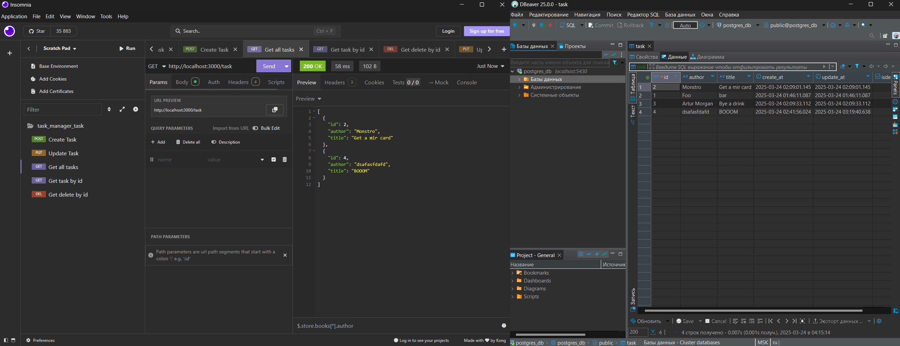

# Презентационный проект
## Запуск
**postgresql** запускается через *docker compose*
Сама программа **app** запускается через *go build* (TODO)
Файл конфигурации _internal/config/config.go_ (TODO .env)

## Скриншот
